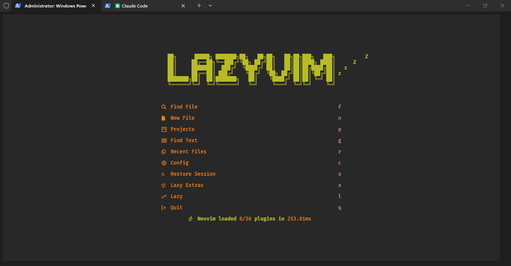
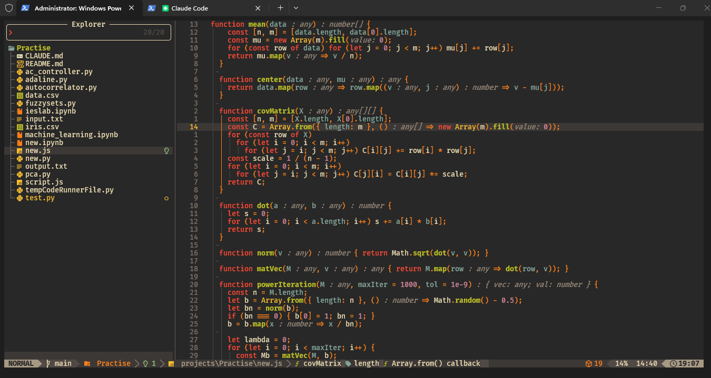
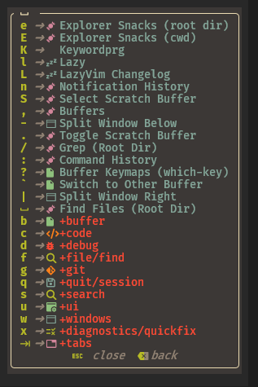

# Neovim Config

My personal Neovim configuration built on [LazyVim](https://github.com/LazyVim/LazyVim) with the **Gruvbox** colorscheme.

## Plugins

| Plugin | Purpose |
|--------|---------|
| [LazyVim/LazyVim](https://github.com/LazyVim/LazyVim) | Base IDE layer — LSP, completions, formatting, UI, and sensible defaults |
| [folke/lazy.nvim](https://github.com/folke/lazy.nvim) | Plugin manager |
| [ellisonleao/gruvbox.nvim](https://github.com/ellisonleao/gruvbox.nvim) | Gruvbox colorscheme |
| [nvim-telescope/telescope.nvim](https://github.com/nvim-telescope/telescope.nvim) | Fuzzy finder for files, grep, buffers, and more |
| [nvim-telescope/telescope-file-browser.nvim](https://github.com/nvim-telescope/telescope-file-browser.nvim) | File browser extension for Telescope |
| [nvim-lua/plenary.nvim](https://github.com/nvim-lua/plenary.nvim) | Utility library (Telescope dependency) |

### LazyVim Extras Enabled

- `lazyvim.plugins.extras.lang.typescript` — TypeScript/JavaScript language support
- `lazyvim.plugins.extras.lang.json` — JSON language support

## Key Mappings

All default [LazyVim keymaps](https://www.lazyvim.org/keymaps) apply. Custom additions:

| Mapping | Mode | Description |
|---------|------|-------------|
| `<leader>sB` | Normal | Browse files (Telescope file browser, rooted at current file's directory) |

## Installation

### Requirements

- [Neovim](https://neovim.io/) >= 0.9.0
- [Git](https://git-scm.com/)
- A [Nerd Font](https://www.nerdfonts.com/) (for icons)
- [ripgrep](https://github.com/BurntSushi/ripgrep) (for Telescope live grep)
- A C compiler (for treesitter) — on Windows, `zig` or MSVC work well

### Steps

1. **Back up** any existing Neovim config:

   ```powershell
   # Windows
   Move-Item $env:LOCALAPPDATA\nvim $env:LOCALAPPDATA\nvim.bak
   ```

2. **Clone** this repo:

   ```powershell
   git clone https://github.com/<your-username>/nvim.git $env:LOCALAPPDATA\nvim
   ```

3. **Launch** Neovim — lazy.nvim will auto-install all plugins on first run:

   ```
   nvim
   ```

## Structure

```
nvim/
├── init.lua                  # Entry point — loads config.lazy
├── lua/
│   ├── config/
│   │   ├── autocmds.lua      # Custom autocommands
│   │   ├── keymaps.lua       # Custom key mappings
│   │   ├── lazy.lua          # lazy.nvim bootstrap and plugin spec
│   │   ├── lazyvim.lua       # LazyVim options (colorscheme)
│   │   └── options.lua       # Vim options
│   └── plugins/
│       ├── file-browser.lua  # Telescope file browser
│       ├── gruvbox.lua       # Gruvbox colorscheme setup
│       └── telescope.lua     # Telescope core setup
├── stylua.toml               # StyLua formatter config
└── lazyvim.json              # LazyVim metadata
```

## Screenshots




